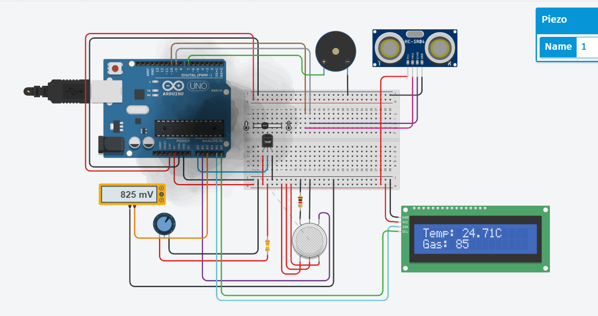

# Mini IoT Weather Station Simulation 🌦️

## 📝 Project Overview
This project simulates a **Mini IoT Weather Station** using **Arduino** in **Tinkercad Circuits**.  
It monitors environmental conditions in real-time using multiple sensors and provides alerts via an LCD display and buzzer when specific thresholds are exceeded.  

**Features based on the Arduino code:**
- **Rain Measurement:** Ultrasonic sensor measures rainfall level in millimeters. A "Rain ALERT!" is triggered on the LCD and buzzer if the rainfall exceeds 100 mm.  
- **Wind Speed Measurement:** Wind sensor provides analog readings converted to MPH. If wind speed exceeds 10 MPH, a "Wind ALERT!" is triggered.  
- **Temperature Measurement:** Analog temperature sensor detects environmental temperature. If temperature exceeds 30°C, a "Temp ALERT!" is triggered.  
- **Gas Detection:** Gas sensor detects harmful gas levels. If the sensor value exceeds 200, a "Gas ALERT!" is triggered.  
- **Alert Priority:** Alerts are prioritized and displayed individually on the LCD with a corresponding buzzer tone.  
- **Normal Display:** If no alert is active, the LCD continuously cycles through normal sensor readings:
  - Rain in mm  
  - Wind speed in MPH  
  - Temperature in °C  
  - Gas sensor value  

This simulation is an excellent way to understand **Arduino sensor integration, analog-to-digital conversions, alert prioritization**, and **I2C LCD interfacing** in a virtual IoT environment.

---

## Components Used 🛠️
| Component | Description |
|-----------|-------------|
| Arduino Uno | Virtual microcontroller |
| Temperature Sensor | Analog sensor for temperature |
| Potentiometer 250 kΩ | For adjusting thresholds |
| Gas Sensor | Detects harmful gases |
| Ultrasonic Sensor | Measures rainfall / distance |
| Buzzer | Audible alerts for thresholds |
| LCD Display (16×2 I2C) | Shows sensor readings and alerts |
| Resistor 325 Ω |  Electrical resistance component |
| Resistor 1 kΩ |  Electrical resistance component |
| Multimeter | Virtual voltage/current measurement |
| Jumper wires & Breadboard | Tinkercad virtual connections |

---

## Circuit Preview
Below is the visual layout of the circuit used in the simulation.  
  

---

## Arduino Code 💻
```cpp
#include <Wire.h>
#include <LiquidCrystal_I2C.h>  // Import the library for I2C LCD

// Sensor variables
float temp_vout, temp, voltage, rain, V_wind;
int gas_sensor_value, Windspeedint;
bool rainAlert = false, windAlert = false, tempAlert = false, gasAlert = false;

// Pin definitions
const int gas_sensor_port = A1;
const int triggerPin = 10;
const int echoPin = 9;
const int buzzerPin = 7;
const int temp_sensor_pin = A0;
const int wind_sensor_pin = A2;

// LCD initialization
LiquidCrystal_I2C lcd(0x27, 16, 2);

void setup() {
  pinMode(gas_sensor_port, INPUT);
  pinMode(temp_sensor_pin, INPUT);
  pinMode(wind_sensor_pin, INPUT);
  pinMode(triggerPin, OUTPUT);
  pinMode(echoPin, INPUT);
  pinMode(buzzerPin, OUTPUT);
  
  lcd.init();
  lcd.backlight();
  Serial.begin(9600);
}

void loop() {
  // Measure Rainfall
  digitalWrite(triggerPin, LOW);
  delayMicroseconds(2);
  digitalWrite(triggerPin, HIGH);
  delayMicroseconds(10);
  digitalWrite(triggerPin, LOW);
  long duration = pulseIn(echoPin, HIGH);
  rain = 0.01723 * duration;
  rainAlert = (rain > 100);

  // Measure Wind Speed
  V_wind = analogRead(wind_sensor_pin) * (5.0 / 1023.0);
  Windspeedint = (V_wind - 0.4) * 20;
  windAlert = (Windspeedint > 10);

  // Measure Temperature
  temp_vout = analogRead(temp_sensor_pin);
  voltage = temp_vout * 0.0048828125;
  temp = (voltage - 0.5) * 100.0;
  tempAlert = (temp > 30);

  // Measure Gas Level
  gas_sensor_value = analogRead(gas_sensor_port);
  gasAlert = (gas_sensor_value > 200);

  // Prioritize and Display Alerts
  if (gasAlert) {
    lcd.clear();
    lcd.setCursor(0, 0);
    lcd.print("Gas ALERT!");
    tone(buzzerPin, 1200, 2000);
    delay(2000);
  }
  if (tempAlert) {
    lcd.clear();
    lcd.setCursor(0, 0);
    lcd.print("Temp ALERT!");
    tone(buzzerPin, 600, 2000);
    delay(2000);
  }
  if (rainAlert) {
    lcd.clear();
    lcd.setCursor(0, 0);
    lcd.print("Rain ALERT!");
    tone(buzzerPin, 1000, 2000);
    delay(2000);
  }
  if (windAlert) {
    lcd.clear();
    lcd.setCursor(0, 0);
    lcd.print("Wind ALERT!");
    tone(buzzerPin, 800, 2000);
    delay(2000);
  }

  // Display Normal Readings
  lcd.clear();
  lcd.setCursor(0, 0);
  lcd.print("Rain: "); lcd.print(rain); lcd.print("mm");
  lcd.setCursor(0, 1);
  lcd.print("Wind: "); lcd.print(Windspeedint); lcd.print("MPH");
  delay(2000);

  lcd.clear();
  lcd.setCursor(0, 0);
  lcd.print("Temp: "); lcd.print(temp); lcd.print("C");
  lcd.setCursor(0, 1);
  lcd.print("Gas: "); lcd.print(gas_sensor_value);
  delay(2000);
}
